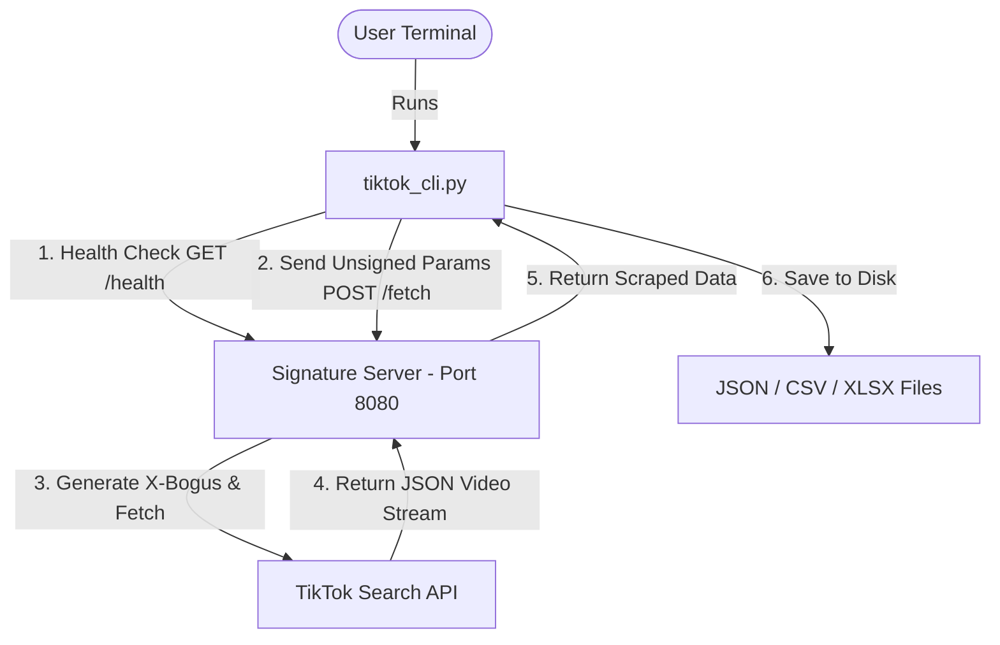

# 🎵 TikTok Search Scraper CLI


An asynchronous, API-based CLI tool to search TikTok videos by keyword using an external signature server. Features real-time terminal progress indicators and exports detailed video metadata to **JSON**, **CSV**, or **Excel (`.xlsx`)**.

---

## 📌 Table of Contents
- [Features](#-features)
- [System Architecture](#-system-architecture)
- [Requirements](#-requirements)
- [Quick Start (Automated)](#-quick-start-automated)
  - [Windows](#windows)
  - [Linux / macOS](#linux--macos)
- [Manual Setup](#-manual-setup)
- [Usage Flow](#-usage-flow)
- [Export Data Schema](#-export-data-schema)
- [Example JSON Output](#-example-json-output)
- [Project Structure](#-project-structure)
- [Troubleshooting](#-troubleshooting)
- [Credits & Disclaimer](#-credits--disclaimer)

---

## ✨ Features

- ⚡ **Asynchronous Scraping**: Powered by `asyncio` & `aiohttp` for ultra-fast data fetching.
- 🔑 **No Local Browser Needed**: Uses [`tiktok-signature-python`](https://github.com/afrzlfaiz/tiktok-signature-python) server for signing requests (`X-Bogus`, `msToken`).
- 🎨 **Rich Interactive CLI**: Styled terminal output with progress reporting, status colors, and interactive prompts.
- 📊 **Multi-Format Export**: Export scraped data directly to `JSON`, `CSV`, or `Excel (.xlsx)`.
- 🤖 **Automated Environment Setup**: Includes one-click setup (`setup.sh` / `setup.bat`) and runner (`start.sh` / `start.bat`) scripts.

---

## 🏗️ System Architecture



---

## ⚙️ Requirements

- **Python 3.8+**
- **Playwright + Chromium** (installed automatically via setup script)
- **Git** (optional, used to clone the signature server)

---

## 🚀 Quick Start (Automated)

The automated scripts will clone the signature server, install all Python dependencies, set up Playwright Chromium, and launch both the server and CLI automatically.

### Windows

```powershell
git clone https://github.com/afrzlfaiz/tiktok-scraper.git
cd tiktok-scraper
.\setup.bat
.\start.bat
```

### Linux / macOS

```bash
git clone https://github.com/afrzlfaiz/tiktok-scraper.git
cd tiktok-scraper
chmod +x setup.sh start.sh
./setup.sh
./start.sh
```

---

## 🛠️ Manual Setup

If you prefer to set up the environment manually:

### 1. Install Dependencies
```bash
pip install -r requirements.txt
```

### 2. Set Up Signature Server
```bash
git clone https://github.com/afrzlfaiz/tiktok-signature-python.git
cd tiktok-signature-python
pip install -r requirements.txt
python -m playwright install chromium
```

### 3. Launch Signature Server
```bash
python -m uvicorn main:app --port 8080
```
> The signature server will run at `http://localhost:8080`.

### 4. Run Scraper CLI
In a separate terminal window:
```bash
python tiktok_cli.py
```

---

## 💻 Usage Flow

When you run [`tiktok_cli.py`](tiktok_cli.py), the interactive assistant guides you through:

1. **Keyword Input**: Enter the search term (e.g., `tech reviews`, `kuliner jakarta`).
2. **Video Count**: Specify maximum number of videos to fetch.
3. **Export Decision**: Choose whether to save results to disk.
4. **File Format**: Select between `JSON`, `CSV`, or `XLSX`.
5. **Output Path**: Use the auto-generated timestamped filename or enter a custom path.

---

## 📄 Export Data Schema

The extracted dataset includes the following comprehensive video metrics:

| Field Name | Type | Description | Example |
| :--- | :--- | :--- | :--- |
| `video_id` | String | Unique TikTok Video ID | `"7604314750763224340"` |
| `url` | String | Web link to the video | `"https://www.tiktok.com/@user/video/..."` |
| `username` | String | Creator unique handle | `"tech_reviewer"` |
| `nickname` | String | Creator display name | `"Tech Reviewer ID"` |
| `caption` | String | Full video caption / description | `"Unboxing gadget terbaru #tech #review"` |
| `create_time` | String | Post creation timestamp | `"2026-04-16 22:30:45"` |
| `duration` | Integer | Video length in seconds | `45` |
| `plays` | Integer | Total view count | `1600000` |
| `likes` | Integer | Total like count | `16600` |
| `comments` | Integer | Total comment count | `240` |
| `shares` | Integer | Total share count | `90` |
| `collects` | Integer | Total bookmark/collect count | `315` |
| `followers` | Integer | Author follower count at fetch time | `54200` |
| `music` | String | Background audio track title | `"Original Sound - Tech Reviewer"` |
| `cover` | String | Video thumbnail URL | `"https://p16-sign.tiktokcdn.com/..."` |
| `play_url` | String | Direct video stream URL | `"https://v16-webapp.tiktok.com/..."` |

---

## 📦 Example JSON Output

```json
{
  "total": 1,
  "exported_at": "2026-04-16T22:30:45",
  "videos": [
    {
      "no": 1,
      "video_id": "7604314750763224340",
      "url": "https://www.tiktok.com/@example/video/7604314750763224340",
      "username": "example",
      "nickname": "Example User",
      "caption": "Sample caption #fyp",
      "create_time": "2026-04-16 20:15:00",
      "duration": 30,
      "plays": 1600000,
      "likes": 16600,
      "comments": 240,
      "shares": 90,
      "collects": 412,
      "followers": 12500,
      "music": "Original Sound",
      "cover": "https://p16-sign.tiktokcdn.com/...",
      "play_url": "https://v16-webapp.tiktok.com/..."
    }
  ]
}
```

---

## 📂 Project Structure

```text
tiktok-scraper/
├── tiktok_cli.py              # Main CLI scraper script (asyncio/aiohttp)
├── requirements.txt           # Python dependencies (aiohttp, openpyxl)
├── setup.sh                   # Linux/macOS automated setup script
├── setup.bat                  # Windows automated setup script
├── start.sh                   # Linux/macOS launcher (Starts server + CLI)
├── start.bat                  # Windows launcher (Starts server + CLI)
├── README.md                  # Project documentation
└── tiktok-signature-python/   # Cloned automatically during setup
```

---

## ❓ Troubleshooting

> [!WARNING]
> **Signature Server Not Running (`http://localhost:8080`)**  
> If the CLI reports connection failures, manually start the signature server:
> ```bash
> cd tiktok-signature-python
> python -m uvicorn main:app --port 8080
> ```

> [!TIP]
> **Missing Playwright Chromium Browser**  
> If Playwright throws browser launch errors:
> ```bash
> cd tiktok-signature-python
> python -m playwright install chromium
> ```

> [!IMPORTANT]
> **Port `8080` Conflict**  
> If port `8080` is already in use by another application:
> - **Windows**:
>   ```powershell
>   netstat -ano | findstr :8080
>   taskkill /PID <PID> /F
>   ```
> - **Linux / macOS**:
>   ```bash
>   lsof -i :8080
>   kill -9 <PID>
>   ```

---

## 📜 Credits & Disclaimer

- **Signature Engine**: Built on [`afrzlfaiz/tiktok-signature-python`](https://github.com/afrzlfaiz/tiktok-signature-python).
- **Disclaimer**: This tool is intended strictly for educational, research, and data analysis purposes. Always comply with TikTok's Terms of Service and data privacy policies.
